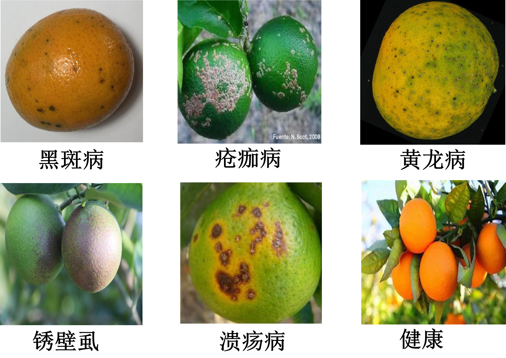
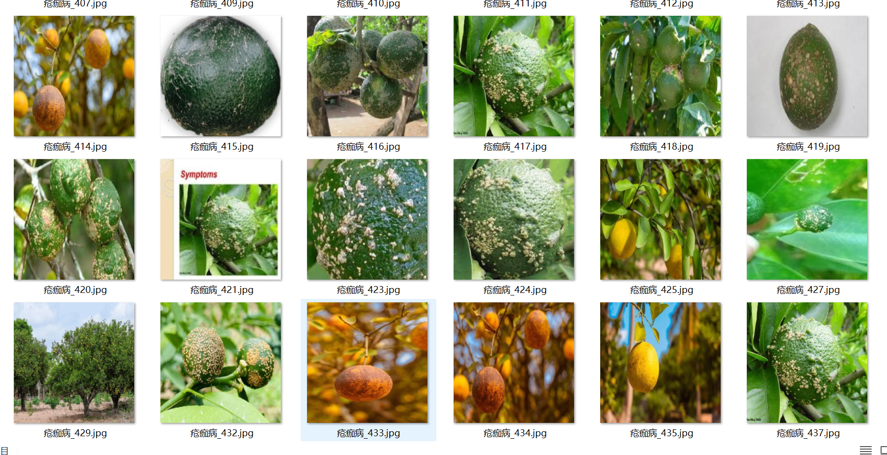
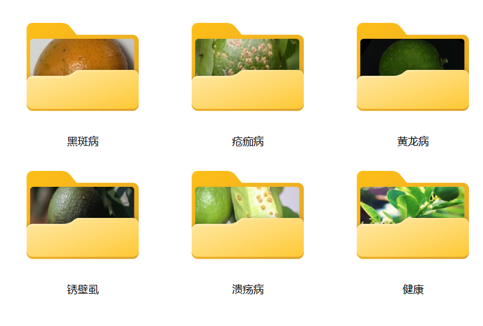

# 6 Types of Citrus Fruit Disease Image Classification Dataset (Optimized for 2026)

Full Dataset Introduction:
Example images from the dataset:
For inquiries, just add your question and you can send it directly. I'm not required to approve your message; you can ask me directly. I can see you.
Search for me, and send all your questions at once. I will reply to you. Sometimes I am busy, so please describe your question and purpose clearly when you send it.
I will also reply to you when I am free, without needing formalities, which makes the process more efficient.
Your phone number is also the same as above; if I forget to reply to you or you are impatient, you can also send a text message or call.

## Images

Here is a pay link on Stripe ( https://buy.stripe.com/3cs8yP7sY87d0vu9AB ). Please contact me lonlonago@foxmail.com after funding $89, and I will send you a complete data files , thank you!

